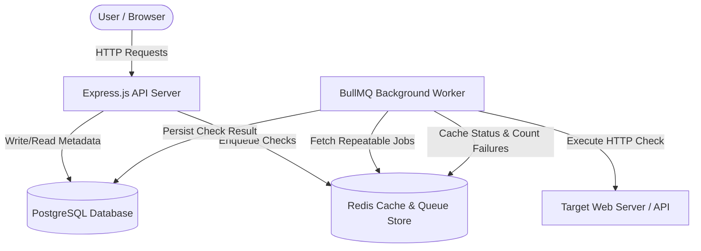
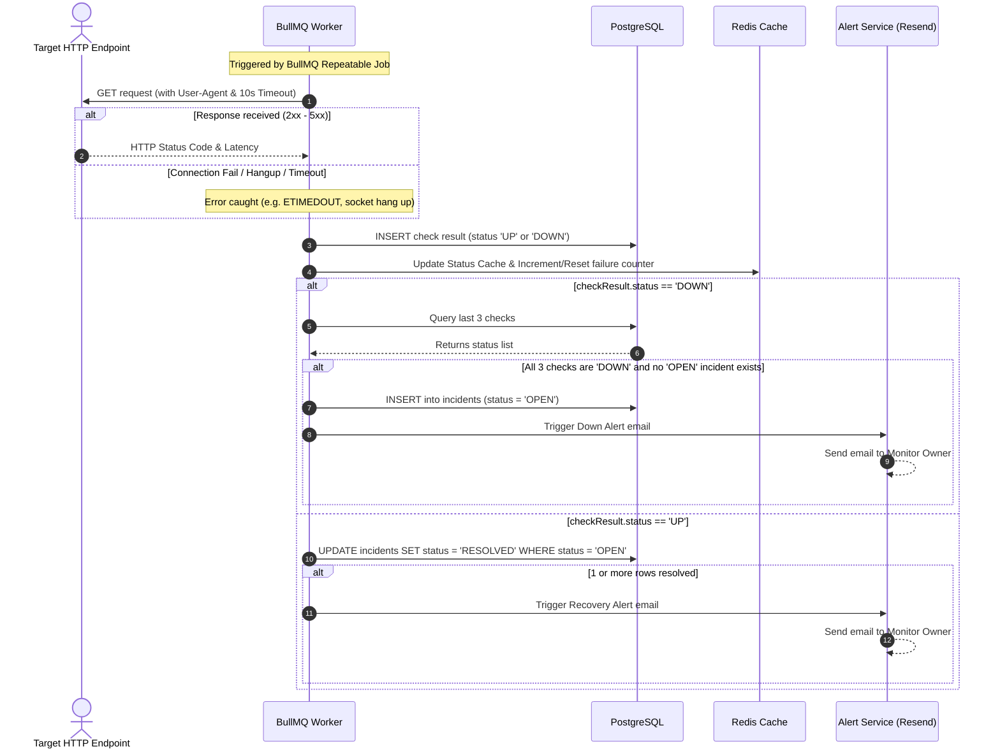
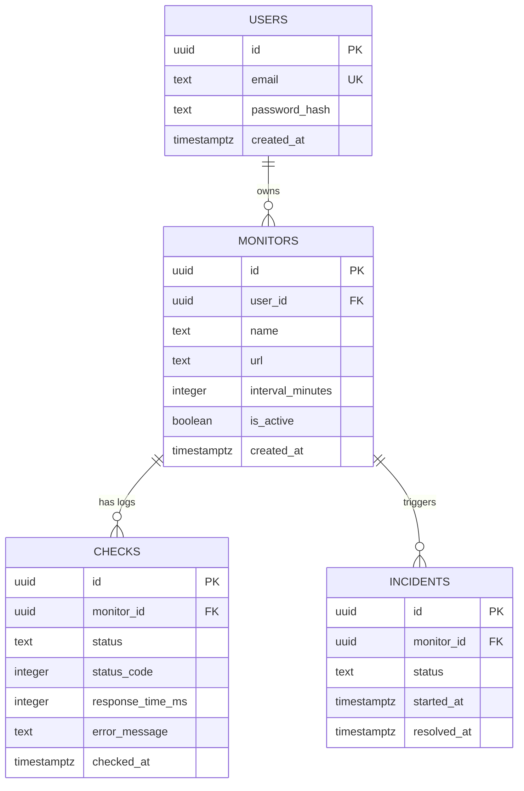

# API Monitor

 API Monitor is a production-grade, distributed API and web health monitoring service. It allows developers and operations teams to monitor target HTTP endpoints, track response latency trends, aggregate health metrics, automatically detect downtime incidents, and send alerts to monitor owners.

The project is structured with a lightweight, containerized Express.js backend, a BullMQ queue processor backed by Redis, and a modern, minimalist React (Vite) frontend styled with a light enterprise theme.

---

## Architecture Overview

The platform uses a decoupled, background-worker architecture to ensure health checks do not impact API responsiveness or block request-handling threads.

### High-Level Architecture Diagram



### Health Check & Incident Detection Flow



---

## Tech Stack

### Backend
* **Node.js (>=20.0.0)**: Core JavaScript runtime environment.
* **Express.js**: Lightweight framework for the REST API routing.
* **PostgreSQL (v16)**: Primary database for relational metadata storage (users, monitors, checks, and incidents).
* **Redis (v7)**: Backing message broker for queues, and fast status/failure caching.
* **BullMQ**: Redis-backed queue library for scheduling and executing repeatable monitoring checks.
* **Axios**: HTTP client used for outbound endpoint check execution.
* **Resend**: Transactional email API provider for Down and Recovery alerts.

### Frontend
* **React (v19)**: UI component library.
* **Vite**: Frontend build tool and local development proxy.
* **React Router (v6)**: Client-side routing.
* **TanStack Query (React Query)**: Stateful data caching, mutation, and automatic query invalidation.
* **Recharts**: Data visualization library for line charts and donut charts.
* **Tailwind CSS (v3)**: Minimalist style architecture.

---

## Database Design



### Table Relationships
* **`users`**: Stored user details. An email address is unique.
* **`monitors`**: Stored HTTP targets monitored on periodic intervals. Every monitor belongs to a user (`user_id`). On user deletion, monitors are cascading-deleted.
* **`checks`**: Saved health check logs. Cascades on monitor deletion. Holds latency, status code, and optional network error logs.
* **`incidents`**: Tracks downtime incidents. Resolves to `RESOLVED` when targets recover.

---

## Redis Usage Strategy

Redis serves three critical infrastructure purposes in Alexandria:

1. **Queue Store (BullMQ)**: Serves as the high-throughput queue broker. The worker polls Redis to get repeatable checker jobs.
2. **Latest Status Cache (Hash)**: 
   * **Key**: `monitor:{monitorId}:status`
   * **Fields**: `status`, `response_time_ms`, `checked_at`.
   * **TTL**: `interval_minutes * 2 minutes`. Prevents serving stale check logs if the checker job fails, while saving database read traffic on dashboard page refreshes.
3. **Failure Counter**:
   * **Key**: `monitor:{monitorId}:fail_count`
   * **Purpose**: Increments on consecutive failure runs to monitor stability. Deletes immediately on check recovery (`UP`).
   * **TTL**: `600 seconds` (10 minutes).

---

## Incident System Details

### 1. Opening an Incident
* Triggered in the background worker whenever an outbound request results in a `DOWN` status (either a status code `>= 400` or a connection error).
* The worker fetches the **last 3 checks** for the monitor.
* If **all 3** checks have a `DOWN` status, the system checks for any `OPEN` incident for this monitor.
* If none exists, it inserts an `OPEN` incident record and asynchronously triggers the transactional email down alert via Resend to the monitor owner.

### 2. Resolving an Incident
* Triggered in the worker when a check succeeds (`UP`).
* It executes an atomic `UPDATE` query:
  ```sql
  UPDATE incidents SET status = 'RESOLVED', resolved_at = NOW() WHERE monitor_id = $1 AND status = 'OPEN';
  ```
* If exactly 1 row is modified, a recovery alert email is triggered, detailing the outage duration and recovery timestamp. If 0 rows are modified, it silently returns (idempotency guard).

---

## API Documentation

All monitor endpoints (except public health routes) require a JWT Bearer token:
`Authorization: Bearer <JWT_TOKEN>`

### 1. Public Endpoints

#### `GET /health`
* **Auth**: None
* **Description**: Database and Redis connection checker.
* **Success Response (200)**:
  ```json
  {
    "status": "healthy",
    "database": "connected",
    "redis": "connected"
  }
  ```

#### `POST /auth/register`
* **Auth**: None
* **Request Body**:
  ```json
  {
    "email": "user@example.com",
    "password": "strongpassword"
  }
  ```
* **Success Response (201)**:
  ```json
  {
    "user": {
      "id": "e2926710-53bc-40d0-8f96-be9bf7491cf1",
      "email": "user@example.com",
      "created_at": "2026-06-08T18:00:00Z"
    }
  }
  ```
* **Error Response (409 Conflict)**:
  ```json
  { "error": "Email is already registered" }
  ```

#### `POST /auth/login`
* **Auth**: None
* **Request Body**:
  ```json
  {
    "email": "user@example.com",
    "password": "strongpassword"
  }
  ```
* **Success Response (200)**:
  ```json
  {
    "user": {
      "id": "e2926710-53bc-40d0-8f96-be9bf7491cf1",
      "email": "user@example.com"
    },
    "token": "eyJhbGciOiJIUzI1NiIsIn..."
  }
  ```
* **Error Response (401 Unauthorized)**:
  ```json
  { "error": "Invalid email or password" }
  ```

---

### 2. Monitors API (Auth Required)

#### `GET /monitors`
* **Description**: Retrieve all monitors owned by the authenticated user.
* **Success Response (200)**:
  ```json
  {
    "monitors": [
      {
        "id": "d47b35a3-f173-4bfc-90c7-f34974f7861a",
        "user_id": "e2926710-53bc-40d0-8f96-be9bf7491cf1",
        "name": "Wikipedia",
        "url": "https://www.wikipedia.org/",
        "interval_minutes": 5,
        "is_active": true,
        "created_at": "2026-06-08T17:19:49.676Z"
      }
    ]
  }
  ```

#### `POST /monitors`
* **Description**: Create a new health monitor and schedule its repeatable check.
* **Request Body**:
  ```json
  {
    "name": "Wikipedia",
    "url": "https://www.wikipedia.org/",
    "interval_minutes": 5
  }
  ```
* **Success Response (201)**:
  ```json
  {
    "monitor": {
      "id": "d47b35a3-f173-4bfc-90c7-f34974f7861a",
      "user_id": "e2926710-53bc-40d0-8f96-be9bf7491cf1",
      "name": "Wikipedia",
      "url": "https://www.wikipedia.org/",
      "interval_minutes": 5,
      "is_active": true,
      "created_at": "2026-06-08T17:19:49.676Z"
    }
  }
  ```

#### `PATCH /monitors/:id`
* **Description**: Edit monitor settings. Exposes *only* allowed fields (`name`, `interval_minutes`, `is_active`). Reschedules worker jobs if interval changes.
* **Request Body**:
  ```json
  {
    "name": "Wikipedia Main Portal",
    "is_active": false
  }
  ```
* **Success Response (200)**:
  ```json
  {
    "monitor": {
      "id": "d47b35a3-f173-4bfc-90c7-f34974f7861a",
      "user_id": "e2926710-53bc-40d0-8f96-be9bf7491cf1",
      "name": "Wikipedia Main Portal",
      "url": "https://www.wikipedia.org/",
      "interval_minutes": 5,
      "is_active": false,
      "created_at": "2026-06-08T17:19:49.676Z"
    }
  }
  ```

#### `DELETE /monitors/:id`
* **Description**: Delete a monitor, cascading deletes on historical checks, and removing BullMQ checker jobs.
* **Success Response (200)**:
  ```json
  { "message": "Monitor deleted successfully" }
  ```

---

### 3. Check Metrics & History (Auth Required)

#### `GET /monitors/:id/status`
* **Description**: Retrieve the latest check result. Queries Redis status cache first.
* **Success Response (200)**:
  ```json
  {
    "check": {
      "status": "UP",
      "status_code": 200,
      "response_time_ms": 132,
      "error_message": null,
      "checked_at": "2026-06-08T18:17:43.000Z"
    }
  }
  ```

#### `GET /monitors/:id/metrics`
* **Description**: Retrieve conditional aggregated statistics over all historical checks.
* **Success Response (200)**:
  ```json
  {
    "total_checks": 140,
    "up_checks": 139,
    "down_checks": 1,
    "uptime_percentage": 99.28,
    "avg_response_time_ms": 234.45
  }
  ```

#### `GET /monitors/:id/checks`
* **Description**: Retrieve the last 100 raw check logs for the target.
* **Success Response (200)**:
  ```json
  {
    "checks": [
      {
        "status": "UP",
        "status_code": 200,
        "response_time_ms": 240,
        "error_message": null,
        "checked_at": "2026-06-08T18:17:43.000Z"
      }
    ]
  }
  ```

---

## Security
* **Password Hashing**: Uses `bcrypt` with a work factor of 10 for registration and sign-in authentication.
* **Authentication**: Exclusively JWT-based Bearer tokens. JWT tokens expire and require sign-in refresh.
* **Rate Limiting**:
  * **Global Limiter**: 100 requests per 15 minutes per IP address.
  * **Auth Limiter**: 5 requests per 1 minute per IP on `/auth/login` and `/auth/register` to block brute-force attempts.
* **Data Leakage Guards**: Scoped database queries enforce ownership via `WHERE user_id = $userId`. Attempts to access or modify monitors belonging to other users return `404 Not Found` rather than `403 Forbidden` to prevent account enum leakage.

---

## Local Development Setup

### Prerequisites
* **Docker & Docker Compose**
* **Node.js (>= 20.0.0)**

### 1. Backend Service Launch
1. Clone the repository and navigate to the project directory:
   ```bash
   git clone <repo-url>
   cd api_monitoring
   ```
2. Configure environmental variables in `.env`:
   ```bash
   cp .env.example .env
   ```
3. Build and launch the container suite:
   ```bash
   docker compose up --build -d
   ```
4. Run migrations inside the API container to initialize PostgreSQL schemas:
   ```bash
   npm run migrate
   ```

### 2. Frontend Development Server
1. Navigate to the frontend directory:
   ```bash
   cd frontend
   ```
2. Install dependencies:
   ```bash
   npm install
   ```
3. Launch the Vite hot-reloading dev server:
   ```bash
   npm run dev
   ```
4. Open the browser to [http://localhost:5173](http://localhost:5173). The proxy forwards all API calls to the backend on `http://localhost:3000`.

---

## Environment Variables

| Variable | Description | Example / Default |
|----------|-------------|-------------------|
| `PORT` | Listening port for the REST API server | `3000` |
| `DB_HOST` | Relational database host pointer | `postgres` (or `localhost` outside Docker) |
| `DB_PORT` | PostgreSQL listening port | `5432` |
| `DB_USER` | Database user name credentials | `api_user` |
| `DB_PASSWORD`| Database user password | `api_password` |
| `DB_NAME` | Relational database schema name | `api_monitoring` |
| `REDIS_HOST` | Redis cache and queue broker host | `redis` (or `localhost` outside Docker) |
| `REDIS_PORT` | Redis server listening port | `6379` |
| `JWT_SECRET` | Signing secret key for token validation | `long_random_jwt_secret_phrase` |
| `RESEND_API_KEY`| Transactional Resend mail token | `re_WuvHfLnV_4e...` |
| `ALERT_FROM_EMAIL`| Verified Resend domain sender | `onboarding@resend.dev` |
| `ALERT_TO_EMAIL`| Test mail override address | `your_email@gmail.com` |

---

## Project Structure

```
api_monitoring/
├── migrations/                 # SQL database schemas
├── scripts/                    # Helper scripts (migrations launcher)
├── src/
│   ├── config/                 # Redis, DB, and Env parsers
│   ├── controllers/            # Request handlers (Auth, CRUD, Checks)
│   ├── middleware/             # Rate limiters & JWT validators
│   ├── queues/                 # BullMQ connection adapters
│   ├── routes/                 # Express Router bindings
│   ├── services/               # Relational operations & incident engines
│   ├── workers/                # BullMQ checker process and DNS configuration
│   ├── app.js                  # Express middleware chain
│   └── server.js               # HTTP listener and main bootstrap
├── frontend/
│   ├── src/
│   │   ├── api/                # Axios client configurations
│   │   ├── components/         # Reusable layouts and Navbar
│   │   ├── context/            # Auth session provider
│   │   ├── pages/              # Views (Login, Register, Dashboard, Details)
│   │   ├── index.css           # Tailwind design tokens
│   │   └── App.jsx             # React Routing configuration
│   ├── tailwind.config.js      # Layout customization config
│   └── vite.config.js          # Proxied server routing
├── docker-compose.yml          # Container configuration
└── Dockerfile                  # API image configuration
```

---

## Interview Talking Points

### Why BullMQ & Background Workers?
* If checks ran in the Express main thread on timer intervals, the API loop would slow down under load. Decoupling checking to a BullMQ worker running in a separate thread/container ensures that the API remains responsive.
* BullMQ provides robust task guarantees, handles retries, and stores execution states in Redis, preventing jobs from dropping.

### Why Redis Caching?
* Refreshes to the Dashboard overview page would otherwise hit PostgreSQL for every monitor to fetch the latest checks. Reading from Redis hash cache resolves latest check states instantly, sparing relational database IOPS.

### Why a 3-Check Failure Buffer?
* Network connections are noisy. Opening an incident on a single request timeout creates "alert fatigue". Requiring 3 consecutive checks to fail ensures alert accuracy and isolates transient glitches.

---

## Future Improvements
1. **Retry Jitter**: Implement exponential retry backoffs for checking targets to avoid DDOSing servers experiencing temporary traffic spikes.
2. **Dead Letter Queue (DLQ)**: Queue checks that fail permanently (such as target host DNS deletion) to a DLQ rather than retrying indefinitely.
3. **WebSockets**: Push latest check latencies from the worker to the frontend dashboard in real-time, removing the need for page reloads.
